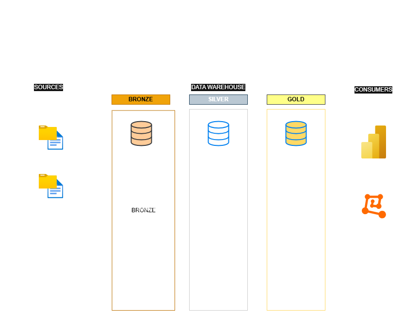
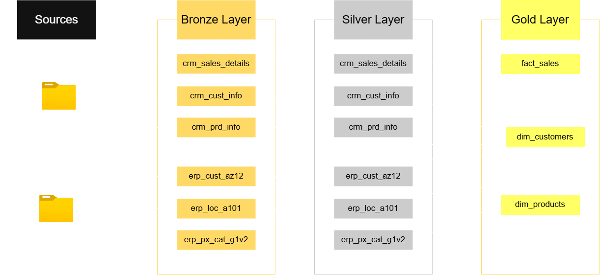

# Modern Data Warehouse Project
---

## Summary
The project consist on the apploication of modern concepts for building a data warehouse. It is intended for learning and skill building applications. The project will utilize MS SQL Server as the DBM for the data warehouse. DRAW.io for documntaion of diagrams. Git for version control and documentation of the work performed.

## Architecture
The project will follow the following architecture:

### Source
For the source, there are a total of 6 CSV files that will be utilized as the source files. Three contain transation, product, and customer records denominated by the prefix CRm and the other three ERP files will contain reference infromation.

### Data Warehouse

This wil follow a Medallion Model Architecture. Which consistes in three layers for the data warehouse where teh ETL operations will take place:

* **Bronze** - The ingestion phase where the data will be taken raw fromt he CSV files
* **Silver** - The transfromation and cleaning phase of the data ingested in the bronze layer.
* **Gold** - The Preparation of the business views for data analytics and reporting.

# Exploratory Data Anlysis

## Summary

For the EDA (Exploratory Data Analysis), the following types of analysis were performed:

* **Database Exploration** - The databse was queried to find and look at the differetn tables and views as well as columns that exist currently on the Data Warehouse database. 
* **Dimension Exploration** - The views were queried to understand the existing dimensions. A demension is defined as the ones answering the questions "Who","Where","When". They are commonly utilized as fields for grouping other measurable fields.
* **Measures Exploration** - The views were queried to understand the existing measures. A measure is defined as one that answers the questions "How Much", "How Many", "Total". They are fields that can be aggregated commonly numerical fields.
* **Date Exploration** - The views were queried to understand the existing date fields. What they represent and the span of years pr motnhs worth of data existing.
* **Magnitude Exploration** - The views qere queried to answer questions about a measures grouped by a dimension.
* **Ranking Exploration** - The views were queried to answer questions about measures groupbed by dimensions to reveal important metrics like top 10, highest or lowst magnitudes based on dimension groupings.